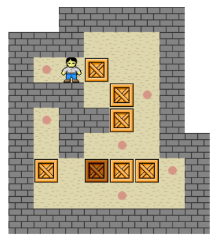
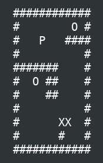

# my_sokoban

{EPITECH} The goal of this project is to develop a copy of Sokoban game in terminal mode, using the ncurses library.



## HOW TO USE

### REQUIREMENTS

* [GCC](https://gcc.gnu.org/)
* [Make](https://www.gnu.org/software/make/)
* [NCURSES](https://fr.wikipedia.org/wiki/Ncurses) (for the bonus)

### USAGES

Compilation

```
$>  make
```
Execution

```
$>  ./my_sokoban maps/map1
```

Help

```
$>  ./my_sokoban -h
```

### GAMEPLAY

* Use arrows to move ```P```.
* Press ```SPACE BAR``` to reset.
* Put the ```X``` (boxes) on the ```O``` (storage locations).
* If all the boxes are on the storage locations, you win.
* If none of the boxes can be moved anymore, you lose.

### BONUS

Go to the ```bonus``` directory :

```
$>  make
$>  ./my_sokoban
```
## MAP FORMAT

* You can find exemples in ```maps``` directory.
* The map is made of ```#``` for the walls.
* ```P``` is the player.
* ```X``` are boxes.
* ```O``` are storage locations.

## SCREENSHOTS



## DEVELOPMENT

* [C](https://fr.wikipedia.org/wiki/C_(langage))
* [NCURSES](https://fr.wikipedia.org/wiki/Ncurses)

## AUTHOR

* **Ilan Benarroche** - ([Github](https://github.com/Ilano30) / [LinkedIn](https://www.linkedin.com/in/ilan-benarroche-1a9b33173/))
